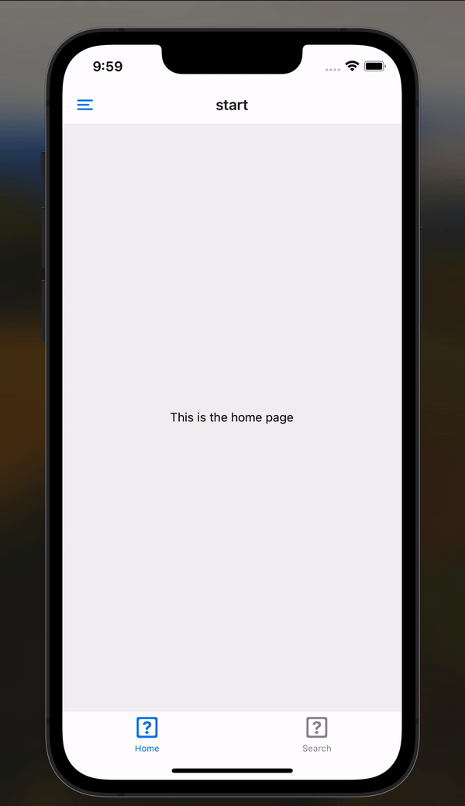

# React-Native-Navigator-Combination
An example project try to mimic the navigation behavior in Linkedin.

## Demo

The tab navigator stays on the screen across different screens in the drawer. In order to achieve this, `DrawerItem` in 
the `CustomDrawerContent` is used to avoid switching screens in the drawer. A hidden screen is added to the bottom tab 
navigator. The `DrawerItem` can then work to navigate to the hidden screen so that the bottom tab navigator still stays.
More screens can be added to the bottom tab navigator.