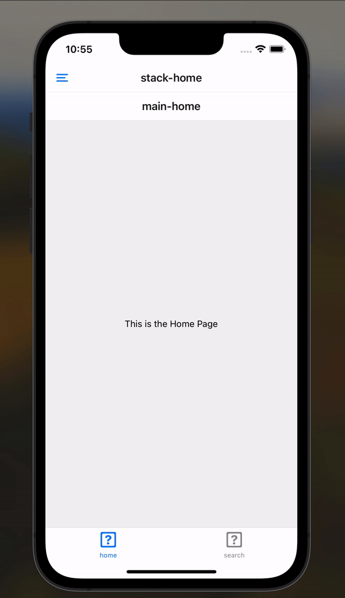

# React-Native-Navigator-Combination
This project demonstrates a navigation structure inspired by LinkedIn's mobile app, using a combination of 
BottomTabNavigator, DrawerNavigator, and StackNavigator in React Native.

## Demo


In this demo, the bottom tab navigator remains visible across different screens, even when navigating through the drawer.
When a drawer item is selected, a stack screen with a return button is presented.

## Navigation Structure
To achieve this seamless navigation, the system is structured as follows:
```
-- BottomTabNavigator
    -- Home
        -- DrawerNavigator-Home
            -- StackNavigator
                -- HomeScreen
                -- ProfileScreen
                -- NotificationScreen
    -- Search
        -- DrawerNavigator-Search
            -- StackNavigator
                -- HomeScreen
                -- ProfileScreen
                -- NotificationScreen
```
### Explanation
- **BottomTabNavigator:** This is the top-level navigator, which ensures that the tab bar stays on the screen across 
different drawer screens. It manages the main tabs such as `Home` and `Search`.
- **DrawerNavigator:** Each tab (e.g., `Home`, `Search`) includes a `DrawerNavigator` containing a single screen that holds a 
`StackNavigator`. The `drawerContent` is customized to display `DrawerItem` components (such as `Profile`, `Notification`). 
Selecting one of these drawer items navigates to the respective screen in the stack.
- **StackNavigator:** The `StackNavigator` contains multiple screens (e.g., `HomeScreen`, `ProfileScreen`, `NotificationScreen`). 
When navigating to a new screen from the drawer, a back button is shown for returning to the previous screen.

## Key Features
- The tab navigator remains visible regardless of which drawer or stack screen you navigate to.
- Each tab has its own drawer menu, which opens different stack screens while keeping the bottom tab persistent.
- When selecting a drawer item, it navigates to the stack screens with a return button visible, allowing the user to go back to the main screen of the tab.

## Running the Project
1. Clone the project
2. Install dependencies with: 
    ```bash
    npm install
    ```
3. Run the project on an emulator or device:
    ```bash
    npx expo start
    ```